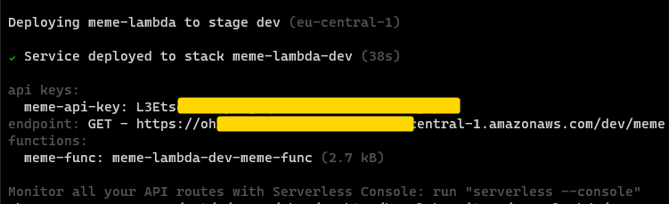
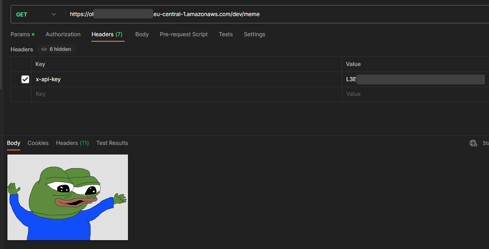

# meme-serverless
This project provides an AWS Lambda function that exposes an HTTP endpoint for fetching a random image from an S3 bucket and returns it as a base64-encoded response. The function can be triggered by an HTTP GET request. It utilizes the Serverless Framework for deployment and configuration.


Name of this project comes from usage I originaly came up with - to fetch random meme from pre-uploaded memes onto my S3 bucket, but this can fetch any image.

## Prerequisites
Before deploying and using this function, make sure you have the following:

- An AWS account
- AWS CLI installed and configured with appropriate credentials
- Serverless Framework installed globally

```bash
npm install -g serverless
```

- An S3 bucket containing the images you want to fetch

## Deployment

1. Clone this repository to your local machine.
2. Navigate to the project directory.
3. Modify the `serverless.yml` file to set the correct S3 bucket name and region, after removing `.example` suffix.
4. Deploy the service using the Serverless Framework.

```bash
serverless deploy
```

The deployment process may take a few minutes. Once completed, you will receive the service endpoint URL along with API key, if configured.



## Usage

After deploying the service, you can access the meme endpoint by sending an HTTP GET request to the specified URL (`/meme` in this case). 
The service may be protected by an API key for added security.



## Configuration
The configuration file (`serverless.yml`) allows you to customize various aspects of the service, such as the AWS region, memory size, IAM permissions, and API Gateway settings. Refer to the comments in the file for more details on each configuration option.

### Setting the S3 Bucket Name
In the `serverless.yml` file, set the `custom.s3BucketName` variable to the name of your S3 bucket

```yaml
custom:
  s3BucketName: my-meme-bucket
```


### Enabling API Key Authentication
To enable API key authentication for the endpoint:

- set the `private` option to true in the `http` event configuration
- make sure to provide API key *name* under `provider.apiGateway.apiKeys` section (AWS will generate random key for you upon deployment, with name associated)


```yaml
functions:
  meme-func:
    # ...
    events:
      - http:
          path: /meme
          method: GET
          private: true

```


```yaml
provider:
  name: aws
  runtime: python3.10
  region: eu-central-1 # your region here
    # ...
  apiGateway:
    apiKeys:
      - "your-api-key"
```

### Region setup

To set the AWS region, you can modify the `provider.region` field. Here's an example:

```yaml
provider:
  name: aws
  runtime: python3.10
  region: us-west-2 # Replace with your desired region
  memorySize: 128
  # ...
```

In the above example, the region is set to `us-west-2`. Replace it with the AWS region code that you want to use, such as `eu-central-1` for the Europe (Frankfurt) region or any other valid region code.


## Things to consider

- because function lists all files inside specified S3 bucket each time it is called, it's performance may degrade with larger amout of files. 
    - bucket content caching solution might be a good idea
    - this function was tested on bucket with 117 files
- `Content-Type` returned is set as `image/jpeg` static. This may create problems for some file types.
    - function was tested with `.png` and `.jpg` images only.
